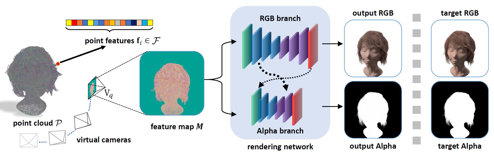

# Neural Opacity Point Cloud (NOPC) [[Project Page]](https://wuminye.github.io/NOPC/) [[Paper]]() 

Pytorch implementation of NOPC.


**Neural Opacity Point Cloud** </br>
[Cen Wang](https://github.com/willona), [Minye Wu](https://github.com/wuminye), Ziyu Wang, Liao Wang, Hao Sheng, Jingyi Yu.</br>
In ICCP 2020.</br>

## Abstract
Fuzzy objects composed of hair, fur, or feather are impossible to scan even with the latest active or passive 3D scanners. We present a novel and practical neural rendering (NR) technique called neural opacity point cloud (NOPC) to allow high quality rendering of such fuzzy objects at any viewpoint. NOPC employs a learning-based scheme to extract geometric and appearance features on 3D point clouds including their opacity. It then maps the 3D features onto virtual viewpoints where a new U-Net based NR manages to handle noisy and incomplete geometry while maintaining translation equivariance. Comprehensive experiments on
existing and new datasets show our NOPC can produce photorealistic rendering on inputs from multi-view setups such as a turntable system for hair and furry toy captures.


## Licenses

<a rel="license" href="http://creativecommons.org/licenses/by-nc-sa/4.0/"></a><br />This work is licensed under a <a rel="license" href="http://creativecommons.org/licenses/by-nc-sa/4.0/">Creative Commons Attribution-NonCommercial-ShareAlike 4.0 International License</a>.

All material is made available under [Creative Commons BY-NC-SA 4.0](https://creativecommons.org/licenses/by-nc-sa/4.0/legalcode) license by Adobe Inc. You can **use, redistribute, and adapt** the material for **non-commercial purposes**, as long as you give appropriate credit by **citing our paper** and **indicating any changes** that you've made.


## Get Started
The designed architecture follows this guide [PyTorch-Project-Template](https://github.com/L1aoXingyu/PyTorch-Project-Template), you can check each folder's purpose by yourself.

Dependencies:
- python 3.6
- [pytorch>=1.2](https://pytorch.org/)
- torchvision
- opencv
- [ignite=0.2.0](https://github.com/pytorch/ignite)
- [yacs](https://github.com/rbgirshick/yacs)
- [Antialiased CNNs](https://github.com/adobe/antialiased-cnns)
- [Pointnet2.PyTorch](https://github.com/sshaoshuai/Pointnet2.PyTorch)
- [apex](https://github.com/NVIDIA/apex)
- [PCPR](https://github.com/wuminye/PCPR)


**1. Prepare dataset**
Prepare a data folder with a structure like following: 
```
.
├──  img
│    └── 0    					
│        └──img_%04d.jpg   		- undistorted RGB images for each view. view number start from 1.
│        └──img_%04d_alpha.png	- alpha mattes for corresponding RGB image.
│
├──  pointclouds				
│    └── frame1.obj			- point cloud. Each row is the "x y z" coordinate for a 3D point.
│
├──  CamPose.inf				-Camera extrinsics. In each row, the 3x4 [R T] matrix is displayed in columns, with the third column followed by columns 1, 2, and 4, where R*X^{camera}+T=X^{world}.
│
└──  Intrinsic.inf				-Camera intrinsics. The format of each intrinsics is: "idx \n fx 0 cx \n 0 fy cy \n 0 0 1 \n \n" (idx starts from 0)
```

**2. Network Training**
- modify configure file [config.yml](./configs/config.yml)
- start training  `python ./tools/train.py`

**3. Rendering**
- `python ./tools/render.py [path to OUTPUT_DIR] [EPOCH_NUM] [path to target Camera Extrinsics & Intrinsics]`
`OUTPUT_DIR` is the data folder. Result images will be saved in this folder.


